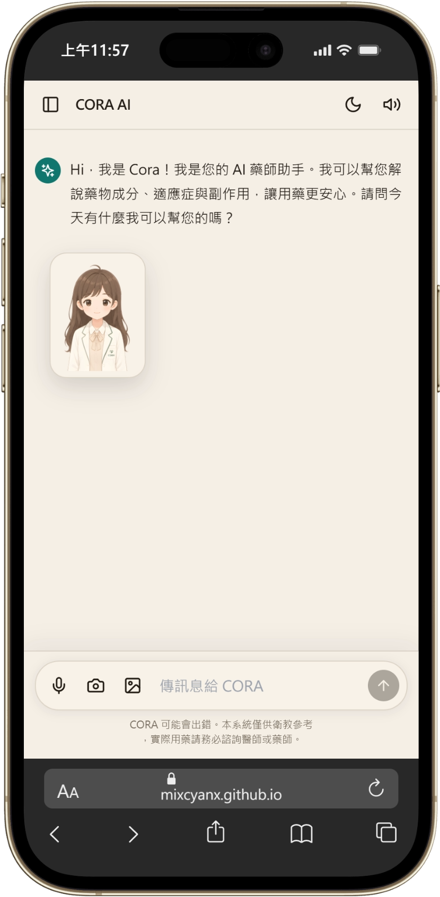

# CORA AI SYSTEM

### AI 智慧藥物解說系統

透過 AI、藥物知識庫與互動式 Avatar，  
讓複雜的藥物資訊變得更容易理解。

[🌐 Online Demo](https://mixcyanx.github.io/CORA-AI-SYSTEM/)

---

## About CORA AI

**CORA AI** 是一套以人工智慧為核心的智慧藥物解說系統。

使用者可以直接用自然語言詢問藥物相關問題，系統會結合 AI 與藥物知識資料，將複雜的藥物資訊轉換成較容易理解的內容。

支援電腦、平板與手機，可直接透過瀏覽器使用。

---

## Screenshots

### 💻 Desktop

  

### 📱 Mobile

  

### 📲 Tablet

  

---

## Features

- 💊 AI 藥物資訊問答
- 🧠 藥物知識庫 / RAG
- 👩‍⚕️ CORA 互動式 Avatar
- 📷 圖片分析
- 🎙️ 語音輸入
- 🔊 AI 回答語音播放
- 🔐 Google 帳號登入
- ☁️ Firebase 對話同步
- 🧠 個人對話記憶
- 🌙 深色 / 淺色模式
- 📱 Responsive Web Design

---

## Technology

- React
- Tailwind CSS
- Cloudflare Workers
- Firebase
- GeminiData
- AI / LLM
- Web Speech API
- GitHub Pages

---

## Live Demo

🌐 **https://mixcyanx.github.io/CORA-AI-SYSTEM/**

---

## Disclaimer

CORA AI 提供的內容僅供資訊與教育用途。

AI 產生的藥物資訊可能存在錯誤、不完整或過時的情況，不應取代醫師、藥師或其他醫療專業人員的診斷與建議。

---

### CORA AI

**Making medication information easier to understand.**

